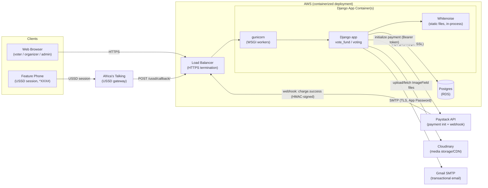

# FlexyVotes — Architecture Overview

For detailed request flows, integration failure modes, configuration, and
technical debt, see the companion [`TRD.md`](./TRD.md) and (schema)
`DATABASE.md`. This document gives a high-level component view and
deployment topology only.

## Component Diagram

## Component Responsibilities

- **Browser client** — organizer dashboard, event pages, ticket purchase
  and voting UI, admin login. Talks to the app over HTTPS only.
- **USSD client (feature phone)** — has no direct connection to the app;
  the mobile network operator routes the USSD session to Africa's Talking,
  which relays each keypress as an HTTP POST to `/ussd/callback/`. The app
  is stateless per-request here — state is reconstructed from the
  accumulated `text` parameter Africa's Talking sends on every step (see
  TRD §4.2).
- **Load balancer** — terminates TLS and forwards HTTP traffic to the
  running app container(s); `SECURE_PROXY_SSL_HEADER` is configured in
  Django (`settings.py`) so the app correctly detects HTTPS when the
  connection is proxied.
- **Django app container (gunicorn + Django + Whitenoise)** — the single
  deployable unit. Gunicorn hosts the Django WSGI app (per `Procfile`:
  `gunicorn vote_fund.wsgi:application --log-file -`); Whitenoise is
  in-process middleware that serves versioned/compressed static assets
  directly from the app container without a separate static file server.
  All business logic — vote/ticket handling, the USSD state machine, the
  Paystack webhook, organizer/admin dashboards — lives in the single
  `voting` app.
- **Postgres (RDS or equivalent)** — system of record for all relational
  data (events, candidates, categories, vote transactions, tickets, voting
  codes, users). Reached via `DATABASE_URL` with `ssl_require=True` and
  connection pooling (`conn_max_age=600`). Local development instead uses
  SQLite with zero configuration.
- **Paystack** — receives payment-initialization requests from the app
  (Bearer-token authenticated) and independently calls back into the app's
  `/webhook/paystack/` endpoint to confirm successful charges, authenticated
  via an HMAC-SHA512 signature over the raw webhook body.
- **Africa's Talking** — USSD gateway relaying phone-keypress sessions into
  `/ussd/callback/`; also exposes a mobile-money checkout API
  (`voting/at_service.py`) that is implemented but not currently invoked by
  any code path (see TRD §10).
- **Cloudinary** — external, durable storage/CDN for every `ImageField`
  (event backgrounds/flyers, candidate photos, product and ticket images)
  in all environments; the app never persists uploaded images to local
  disk in production.
- **Gmail SMTP** — outbound transactional email (organizer approval,
  registration alerts, voting-code retrieval, e-ticket delivery with QR
  attachment), sent synchronously from within the request cycle (no queue).

## Deployment Topology

- The app is packaged as a single Docker container running
  `gunicorn vote_fund.wsgi:application`. The final AWS compute target
  (ECS/Fargate vs. EC2) is not yet fixed; either way the container sits
  **behind a load balancer** that terminates HTTPS and forwards plain HTTP
  to the container(s), matching the `SECURE_PROXY_SSL_HEADER` /
  `SECURE_SSL_REDIRECT` configuration already present in `settings.py`.
- **Static files** are served in-process by Whitenoise
  (`CompressedManifestStaticFilesStorage`) directly from the container — no
  separate static file host is required, though a CDN (e.g. CloudFront) in
  front of the load balancer would be a natural addition and is not yet
  configured in code.
- **Media files** (all user-uploaded images) are offloaded entirely to
  Cloudinary via `django-cloudinary-storage`, so the container itself is
  stateless with respect to media — this matters for horizontal scaling and
  for ECS/Fargate specifically, since container-local disk is ephemeral.
- **Database** is external (Postgres via `DATABASE_URL`), so containers can
  be scaled horizontally without data-locality concerns — except for the
  known caveat that the in-process `LocMemCache`-based rate limiting (login/
  registration attempt counters) does **not** work correctly once more than
  one worker process or container instance is running; that state is not
  externalized (see TRD §8 for the fix — move to Redis/Memcached).
- **Outbound integrations** (Paystack, Africa's Talking, Cloudinary, Gmail
  SMTP) are all plain HTTPS/SMTP calls out to third-party APIs — no VPC
  peering or private connectivity is required; the load balancer/security
  group only needs to allow outbound HTTPS (443) and SMTP submission (587)
  from the app container(s), and inbound HTTPS from the internet (for
  Paystack's webhook and Africa's Talking's USSD callback to reach the app).
