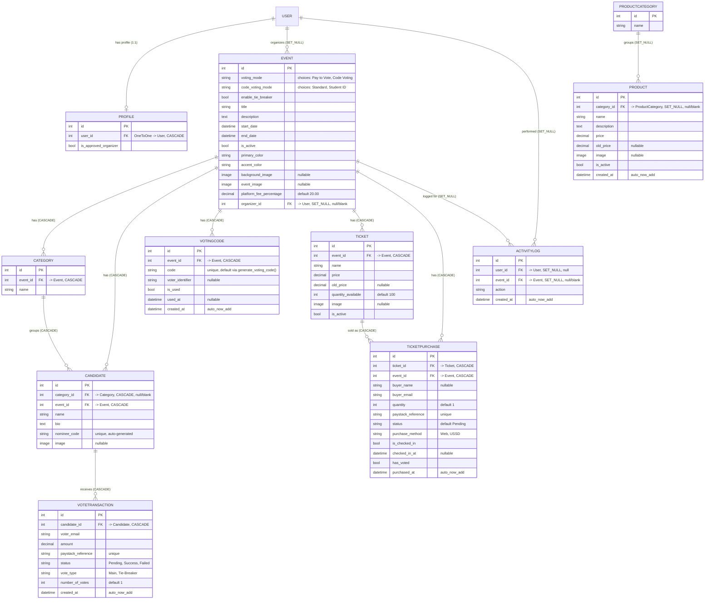

# FlexyVotes Database Schema Reference

This document describes the database schema defined in `voting/models.py`, the
schema's evolution via `voting/migrations/`, and how the database is
configured in `vote_fund/settings.py`.

All models live in the single Django app `voting`. `Profile` and `Event` also
relate to Django's built-in `auth.User` model (not defined in this app, but
included below for context since several relationships point to it).

## 1. Entity-Relationship Overview



Notes on cardinality/on_delete not obvious from the diagram shorthand:

- `Profile.user`: `OneToOneField(User, on_delete=CASCADE)` — deleting a `User`
  deletes their `Profile`.
- `Event.organizer`: `ForeignKey(User, on_delete=SET_NULL, null=True, blank=True, related_name='events')`
  — deleting the organizer user leaves the event intact with `organizer=NULL`.
- `Category.event`, `Candidate.event`, `VotingCode.event`, `Ticket.event`,
  `TicketPurchase.event`: all `CASCADE` — deleting an `Event` deletes all its
  categories, candidates, voting codes, tickets, and ticket purchases.
- `Candidate.category`: `CASCADE`, but `null=True, blank=True` — a candidate
  can exist without a category, but if its category is deleted, the candidate
  row is deleted too (not just the FK nulled).
- `VoteTransaction.candidate`: `CASCADE` — deleting a candidate deletes their
  vote transactions.
- `ActivityLog.user` / `ActivityLog.event`: both `SET_NULL` — logs survive
  deletion of the referenced user or event.
- `Product.category`: `SET_NULL, null=True, blank=True` — deleting a
  `ProductCategory` nulls out `Product.category` rather than deleting products.
- `TicketPurchase.ticket`: `CASCADE` — deleting a `Ticket` deletes its
  purchase records.

## 2. Per-Model Field Reference

### Profile

| Field | Type | Constraints | Purpose |
|---|---|---|---|
| `user` | `OneToOneField(User)` | `on_delete=CASCADE` | Links a Django auth user to app-specific profile data |
| `is_approved_organizer` | `BooleanField` | `default=False` | Gate flag — whether this user is allowed to act as an event organizer |

### Event

| Field | Type | Constraints | Purpose |
|---|---|---|---|
| `voting_mode` | `CharField` | `max_length=20`, `choices=VotingMode` (`Pay to Vote`, `Code Voting`), `default='Pay to Vote'` | Determines whether voting is paid (Paystack) or code-based |
| `code_voting_mode` | `CharField` | `max_length=20`, `choices=CodeVotingMode` (`Standard`, `Student ID`), `default='Standard'` | Sub-mode for code voting: plain codes vs. code + student ID |
| `enable_tie_breaker` | `BooleanField` | `default=False` | Toggles whether tie-breaker voting rounds are enabled for the event |
| `title` | `CharField` | `max_length=200` | Event name |
| `description` | `TextField` | `blank=True` | Free-text event description |
| `start_date` | `DateTimeField` | required | Voting window start |
| `end_date` | `DateTimeField` | required | Voting window end |
| `is_active` | `BooleanField` | `default=True` | Whether the event is currently active/visible |
| `primary_color` | `CharField` | `max_length=7`, `default='#800020'` | Theme color (hex) for event's public page |
| `accent_color` | `CharField` | `max_length=7`, `default='#FFD700'` | Secondary theme color (hex) |
| `background_image` | `ImageField` | `upload_to='event_backgrounds/'`, `blank=True, null=True`, `validate_file_size` (≤2MB) | Background art for the event page |
| `event_image` | `ImageField` | `upload_to='event_flyers/'`, `blank=True, null=True`, `validate_file_size` | Flyer/poster image |
| `platform_fee_percentage` | `DecimalField` | `max_digits=4, decimal_places=2`, `default=20.00` | Percentage cut the platform takes from vote revenue |
| `organizer` | `ForeignKey(User)` | `on_delete=SET_NULL`, `null=True, blank=True`, `related_name='events'` | The user who owns/manages this event |

### Category

| Field | Type | Constraints | Purpose |
|---|---|---|---|
| `event` | `ForeignKey(Event)` | `on_delete=CASCADE`, `related_name='categories'` | Parent event this category belongs to |
| `name` | `CharField` | `max_length=100` | Category label (e.g. "Best Male", "Best Female") |

### Candidate

| Field | Type | Constraints | Purpose |
|---|---|---|---|
| `category` | `ForeignKey(Category)` | `on_delete=CASCADE`, `related_name='candidates'`, `null=True, blank=True` | Optional category grouping within the event |
| `event` | `ForeignKey(Event)` | `on_delete=CASCADE`, `related_name='candidates'` | Parent event |
| `name` | `CharField` | `max_length=100` | Candidate/nominee name |
| `bio` | `TextField` | `blank=True` | Candidate bio |
| `nominee_code` | `CharField` | `max_length=10`, `unique=True`, `null=True, blank=True` | Short public code voters use to identify a candidate; auto-generated on save if blank (see §3) |
| `image` | `ImageField` | `upload_to='candidate_images/'`, `blank=True, null=True`, `validate_file_size` | Candidate photo |

### VoteTransaction

| Field | Type | Constraints | Purpose |
|---|---|---|---|
| `candidate` | `ForeignKey(Candidate)` | `on_delete=CASCADE`, `related_name='transactions'` | Candidate being voted for |
| `voter_email` | `EmailField` | required | Voter's email (used as their identity for the transaction) |
| `amount` | `DecimalField` | `max_digits=10, decimal_places=2` | Amount paid for the vote(s) |
| `paystack_reference` | `CharField` | `max_length=100`, `unique=True` | Paystack payment reference, used to reconcile/verify payment and prevent double-processing |
| `status` | `CharField` | `max_length=10`, `choices=Status` (`Pending`, `Success`, `Failed`), `default='Pending'` | Payment/transaction lifecycle state |
| `vote_type` | `CharField` | `max_length=20`, `choices=VoteType` (`Main`, `Tie-Breaker`), `default='Main'` | Distinguishes a normal vote from a tie-breaker round vote |
| `number_of_votes` | `PositiveIntegerField` | `default=1` | Number of votes purchased in this transaction |
| `created_at` | `DateTimeField` | `auto_now_add=True` | Transaction creation timestamp |

### ActivityLog

| Field | Type | Constraints | Purpose |
|---|---|---|---|
| `user` | `ForeignKey(User)` | `on_delete=SET_NULL`, `null=True` | Actor who triggered the logged action (nullable if user is later deleted) |
| `event` | `ForeignKey(Event)` | `on_delete=SET_NULL`, `null=True, blank=True` | Event the action relates to, if any |
| `action` | `CharField` | `max_length=255` | Free-text description of the action taken |
| `created_at` | `DateTimeField` | `auto_now_add=True` | When the action occurred |

### ProductCategory

| Field | Type | Constraints | Purpose |
|---|---|---|---|
| `name` | `CharField` | `max_length=100` | Category label for merchandise/products |

### Product

| Field | Type | Constraints | Purpose |
|---|---|---|---|
| `category` | `ForeignKey(ProductCategory)` | `on_delete=SET_NULL`, `null=True, blank=True`, `related_name='products'` | Optional product category |
| `name` | `CharField` | `max_length=200` | Product name |
| `description` | `TextField` | `blank=True` | Product description |
| `price` | `DecimalField` | `max_digits=10, decimal_places=2` | Current selling price |
| `old_price` | `DecimalField` | `max_digits=10, decimal_places=2`, `blank=True, null=True` | Previous/list price, used to compute a discount (see §3) |
| `image` | `ImageField` | `upload_to='product_images/'`, `blank=True, null=True`, `validate_file_size` | Product photo |
| `is_active` | `BooleanField` | `default=True` | Whether the product is currently sellable/visible |
| `created_at` | `DateTimeField` | `auto_now_add=True` | Creation timestamp |

### VotingCode

| Field | Type | Constraints | Purpose |
|---|---|---|---|
| `event` | `ForeignKey(Event)` | `on_delete=CASCADE`, `related_name='voting_codes'` | Event this code is valid for |
| `code` | `CharField` | `max_length=50`, `unique=True`, `default=generate_voting_code` | The voting code string itself; auto-generated per instance (see §4) |
| `voter_identifier` | `CharField` | `max_length=100`, `blank=True, null=True` | Optional identifier tying the code to a voter (e.g. student ID) |
| `is_used` | `BooleanField` | `default=False` | Whether the code has been redeemed |
| `used_at` | `DateTimeField` | `null=True, blank=True` | Timestamp the code was redeemed |
| `created_at` | `DateTimeField` | `auto_now_add=True` | Creation timestamp |

### Ticket

| Field | Type | Constraints | Purpose |
|---|---|---|---|
| `event` | `ForeignKey(Event)` | `on_delete=CASCADE`, `related_name='tickets'` | Event this ticket type belongs to |
| `name` | `CharField` | `max_length=100` | Ticket tier name (e.g. "VIP", "Regular") |
| `price` | `DecimalField` | `max_digits=10, decimal_places=2` | Current ticket price |
| `old_price` | `DecimalField` | `max_digits=10, decimal_places=2`, `blank=True, null=True` | Previous/list price, used to compute a discount (see §3) |
| `quantity_available` | `PositiveIntegerField` | `default=100` | Remaining inventory for this ticket tier |
| `image` | `ImageField` | `upload_to='ticket_images/'`, `blank=True, null=True`, `validate_file_size` | Ticket artwork |
| `is_active` | `BooleanField` | `default=True` | Whether the ticket tier is currently on sale |

### TicketPurchase

| Field | Type | Constraints | Purpose |
|---|---|---|---|
| `ticket` | `ForeignKey(Ticket)` | `on_delete=CASCADE`, `related_name='purchases'` | The ticket tier purchased |
| `event` | `ForeignKey(Event)` | `on_delete=CASCADE`, `related_name='ticket_purchases'` | Denormalized link to the event (redundant with `ticket.event` but avoids a join) |
| `buyer_name` | `CharField` | `max_length=150`, `blank=True, null=True` | Buyer's name |
| `buyer_email` | `EmailField` | required | Buyer's email |
| `quantity` | `PositiveIntegerField` | `default=1` | Number of tickets bought in this purchase |
| `paystack_reference` | `CharField` | `max_length=100`, `unique=True` | Paystack payment reference for reconciliation |
| `status` | `CharField` | `max_length=10`, `default='Pending'` | Payment status (plain string field — no `choices` defined, unlike `VoteTransaction.status`) |
| `purchase_method` | `CharField` | `max_length=10`, `choices=PurchaseMethod` (`Web`, `USSD`), `default='Web'` | Channel through which the ticket was bought |
| `is_checked_in` | `BooleanField` | `default=False` | Whether the buyer has checked in at the event |
| `checked_in_at` | `DateTimeField` | `null=True, blank=True` | Check-in timestamp |
| `has_voted` | `BooleanField` | `default=False` | Whether this ticket purchase has already been used to cast a vote (e.g. ticket-linked voting rights) |
| `purchased_at` | `DateTimeField` | `auto_now_add=True` | Purchase timestamp |

## 3. Computed Fields and Business-Logic Methods

- **`Event.get_total_revenue()`**: Aggregates `Sum('transactions__amount')`
  across all `Candidate`s belonging to the event, filtered to
  `transactions__status='Success'` (i.e., only successful `VoteTransaction`
  rows count). Returns `0` if there is no revenue yet, avoiding `None`.
  Traverses `Event.candidates -> Candidate.transactions`.

- **`Event.get_organizer_payout()`**: Calls `get_total_revenue()`, computes
  `fee = total_revenue * (platform_fee_percentage / 100)`, and returns
  `total_revenue - fee`. This is the amount owed to the organizer after the
  platform's cut.

- **`Candidate.save()`**: Overridden to auto-generate `nominee_code` when it
  is blank. It loops, generating a candidate code of the form two random
  uppercase letters + three random digits (e.g. `"TE025"`), and checks
  uniqueness via `Candidate.objects.filter(nominee_code=...).exists()` before
  accepting it. This means nominee codes are only auto-assigned once, at
  first save with no code — a manually-provided `nominee_code` is preserved
  on subsequent saves.

- **`Product.discount_percentage`** and **`Ticket.discount_percentage`**
  (both `@property`, identical logic): if `old_price` is set and greater
  than `price`, returns
  `int(((old_price - price) / old_price) * 100)` — an integer percentage
  discount for display. Returns `0` if there's no `old_price` or `old_price`
  is not greater than `price` (i.e., no discount to show).

## 4. Production-Relevant Model Quirks (Recently Fixed)

- **`VotingCode.code` default is now per-instance.** The field is declared as
  `models.CharField(max_length=50, unique=True, default=generate_voting_code)`,
  where `generate_voting_code()` is a plain function:

  ```python
  def generate_voting_code():
      return uuid.uuid4().hex[:8].upper()
  ```

  Passing the *function* (not a called value) as `default` means Django calls
  it fresh for every new `VotingCode` instance that doesn't specify a code
  explicitly. Migration history (`voting/migrations/0019_...` through
  `0029_alter_votingcode_code.py`, nine migrations touching this one field)
  shows the default was altered repeatedly, consistent with a previously
  buggy version where `default` was set to an *already-evaluated* string
  (e.g. `default=generate_voting_code()` with parentheses, or a module-level
  constant) — computed once at import/migration time — which would have
  caused every new `VotingCode` to receive the *same* code and collide with
  the `unique=True` constraint. The current code is correct: `default` holds
  a callable reference, so it is invoked per-instance at save time.

- **`Ticket` no longer has a duplicate `__str__` method.** The current
  `Ticket` model defines exactly one `__str__`:

  ```python
  def __str__(self):
      return f"{self.name} - {self.event.title}"
  ```

  A previous version of the model apparently defined `__str__` twice
  (likely from a copy/paste when adding the `discount_percentage` property),
  which in Python is harmless but silently means only the second definition
  ever takes effect — the first is simply discarded at class-body
  evaluation time. This has been cleaned up; there is now a single `__str__`
  followed by the `discount_percentage` property.

## 5. Migrations

- `voting/migrations/` contains **29 migrations** (`0001_initial.py` through
  `0029_alter_votingcode_code.py`), plus `__init__.py`. No migrations have
  been squashed or renamed — the history is linear from `0001` to `0029`.
- Notable evolution visible from filenames:
  - `0001_initial.py` — initial schema.
  - `0002`–`0009` — incremental additions to `VoteTransaction`, `Candidate`,
    `Event` (colors, platform fee, organizer, background image), and adding
    `Profile`.
  - `0010`–`0014` — `Category` model added, then `Candidate.category` FK
    wired up, a stray `Event.category` field added and removed
    (`0012_remove_event_category.py`), and `ActivityLog` added.
  - `0015`–`0017` — `Product` and `ProductCategory` added (merch feature).
  - `0018`–`0029` — `VotingCode` added and its `code` field altered
    **eight times** across `0019`, `0020`, `0021`, `0022`, `0023`, `0025`,
    `0027`, `0029` (interleaved with unrelated additions: `Event` voting
    modes, `Candidate.nominee_code`, `Ticket`/`TicketPurchase`, check-in
    fields, `vote_type`, `old_price` on `Ticket`, `enable_tie_breaker`) —
    this repeated altering of `VotingCode.code` is consistent with the
    default-value bug described in §4 being iterated on over time before
    landing on the current per-instance `generate_voting_code` callable.
- **Applying migrations**: `python manage.py migrate` (uses whichever
  database `vote_fund/settings.py` resolves to at runtime — see below).
  Use `python manage.py makemigrations voting` after further model changes.
- **SQLite vs. Postgres**: `vote_fund/settings.py` defaults `DATABASES` to
  local SQLite (`db.sqlite3` in `BASE_DIR`), and overrides it with
  `dj_database_url.config(conn_max_age=600, ssl_require=True)` when a
  `DATABASE_URL` environment variable is present (the production/Postgres
  path). Migration state is tracked per-database (in each database's own
  `django_migrations` table), so switching between SQLite locally and
  Postgres in production is not automatic — `python manage.py migrate` must
  be run again against whichever database `DATABASE_URL` (or its absence)
  points at for that environment before the schema is in sync. A fresh
  Postgres database needs the full migration history (`0001`–`0029`)
  applied from scratch; it does not inherit state from the local SQLite file.
